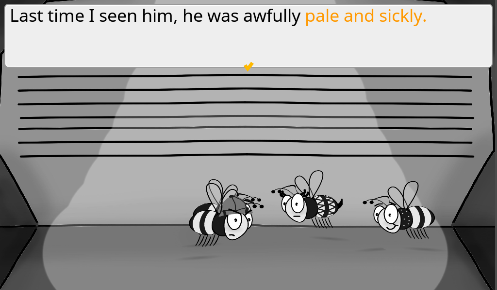

# Beetective
## Ya Like JAS?
### For BL-MSCH-C220 at Indiana University, Bloomington
### April 29, 2020

---

This game was developed as a final project for C220 as part of a 48-hour game jam. 

#### When we considered the theme of Corona, we thought about it this way:

With all the humans gone, animals have a lot more free reign outside and we thought some of them might wonder where the humans went.

#### These are the struggles and surprises we encountered as we developed it:

Sometimes debugging was hard and finding the right resources was that matched was also a challenege.  The short timespan meant that the deadline came much sooner than we expected, and a lot of planned content had to be cut short.

#### These are the technologies and resources we used:

We used Github, Godot, SoundBibile, Photoshop, DL Sounds

#### This is the objective of the game:

You're Beetective Honey, investigating where your Beekeeper has gone. You've lined up a few suspects and now you're going to interrogate them.

#### This is how the game is played:

It's a point and click adventure game, so you can click on who you want to talk to and fly over. 

#### Future plans:

To create a simple fun point and click adventure that anyone can enjoy. In the future we want to do more levels, have animations for the characters and create a bigger story

---

### Team Members

  * Jocelyn Beedie
    * All Programming
  * Samantha Galati
    * Background music
    * Art
  * Alysha Pitman
    * Scriptwriting

